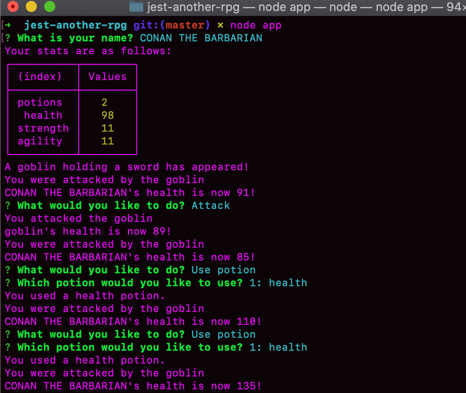

# jest-another-rpg

    
## Description 
Play a game in the command line terminal that is created with Object Oriented Programming and tested (TDD) with the node.js package (jest and inquirer)

## Table of Contents 

* [Installation](#installation)
* [Usage](#usage)
* [Credits](#credits)
* [License](#license)

## Installation 
Git clone the repo to your local computer. You must install node.js and the npm package that has both jest and inquirer through the terminal.

## Usage 
Play a game through the command line terminal through prompts. A character named of your choice battling an enemy. You can select attack or potions each round. The player who has no more health first, loses. Begin the game by typing node app.js into the terminal.

    

## Credits 
Created by the UofA Coding Bootcamp and deployed by Brandi Curley

## License 
NPM Jest and Inquirer

---
🏆 
## Badges

